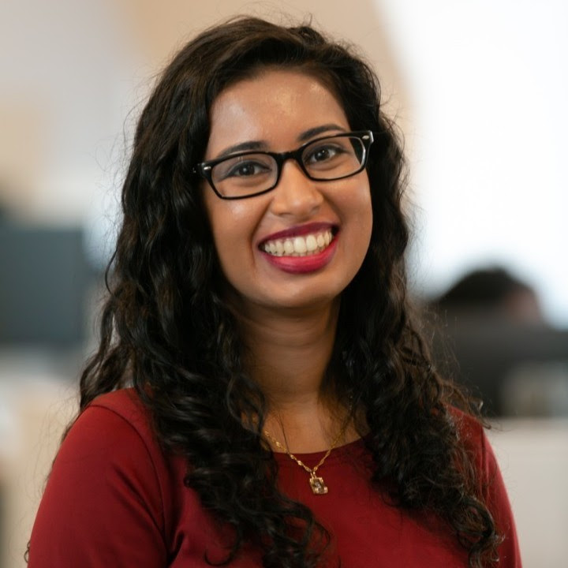
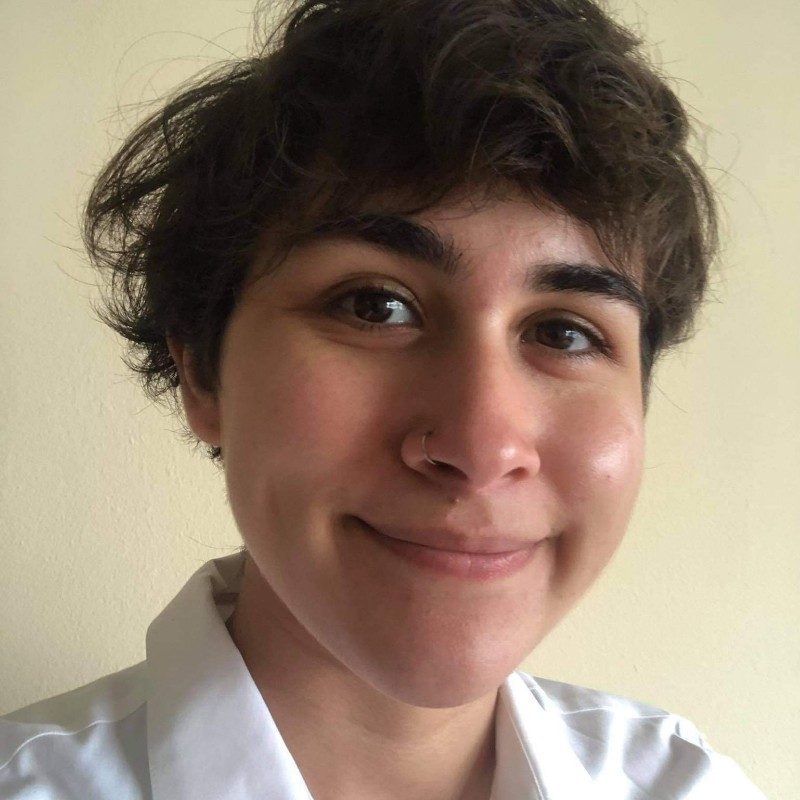
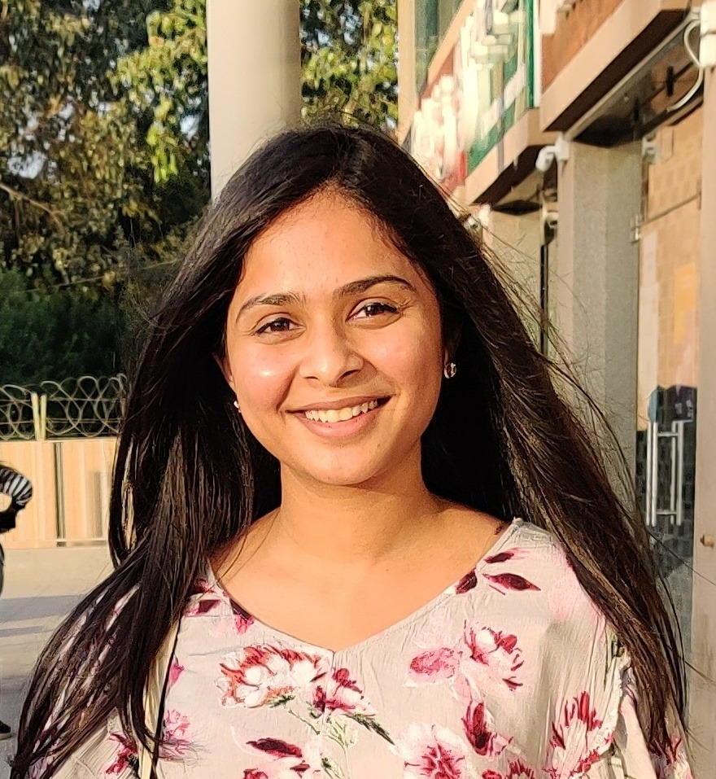
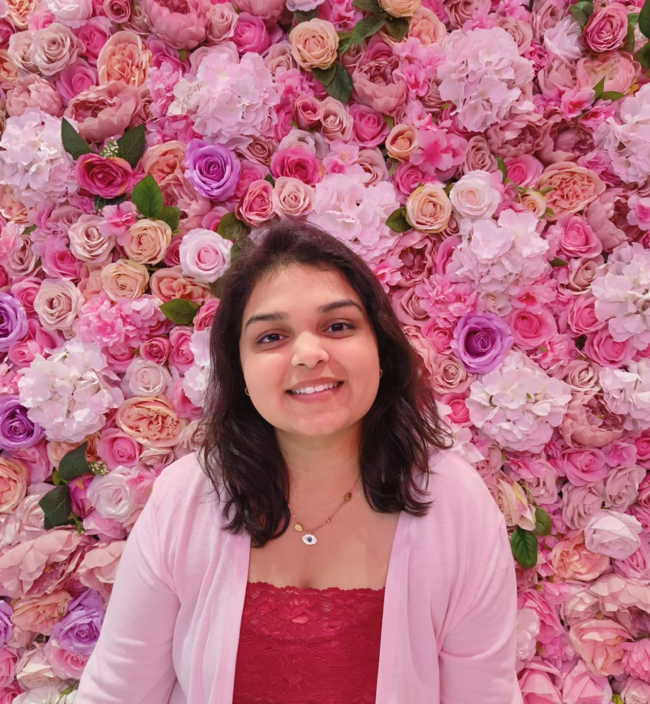
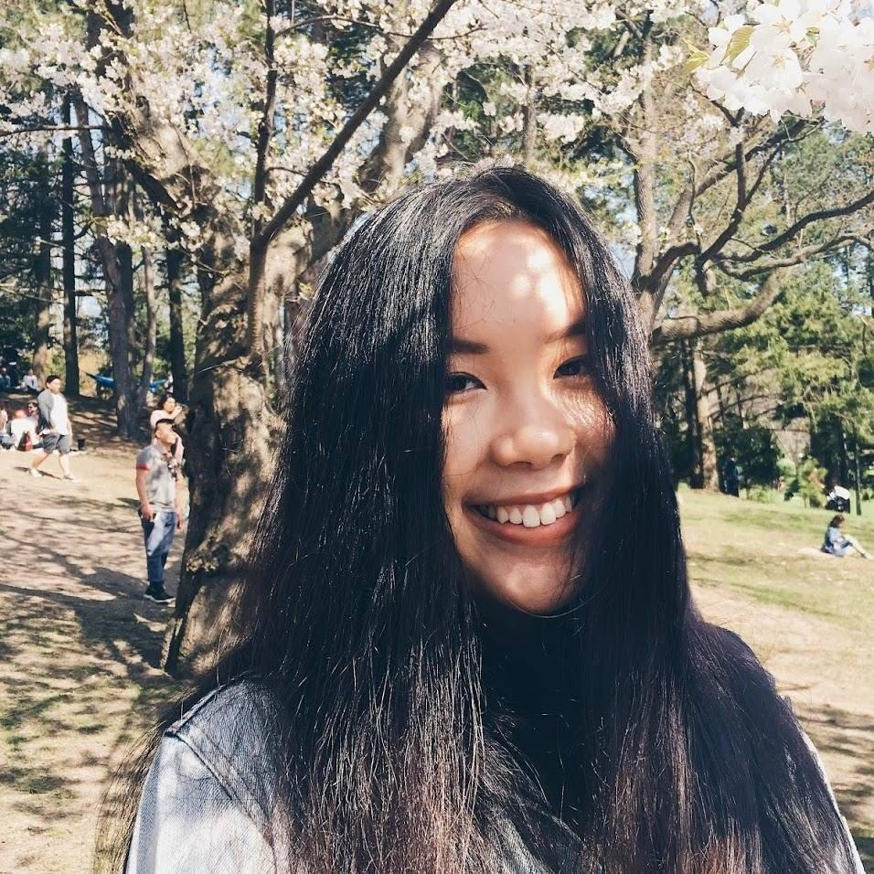

```{r include=FALSE}
library(magick)

library(cropcircles)

# image_Sophia = 
# df <- tibble(y = 1:4, images = images) |>
   #  mutate(images_cropped = circle_crop(images))


```

<br></br>

They say you should never meet your Sheroes, but our dream team of Columbia MPH students is worth the meet and greats, autographs, and signed limited edition funko-pop figurines. 


<br></br>


#  Sneha Mehta


<br></br>

#  Sophia Chkonia


<br></br>

#  Rhea Pawar


<br></br>

#  Shivangi Mewada


<br></br>

#  Cathy Yang

